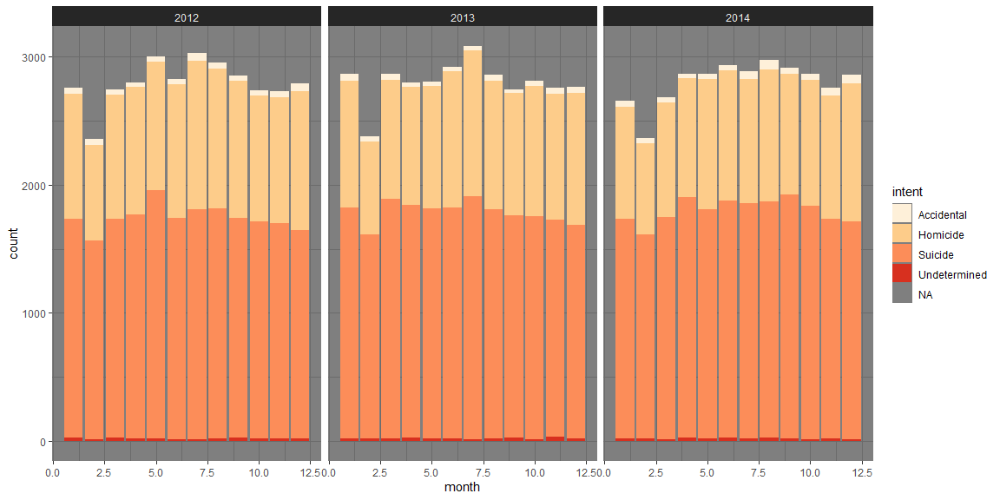

```r
# Import datasets
data <- read.csv('https://raw.githubusercontent.com/fivethirtyeight/guns-data/master/full_data.csv')
```

## Background

The world is a dangerous place. During 2015 and 2016 there was a lot of discussion in the news about police shootings. FiveThirtyEight.com reported on gun deaths in 2016. As leaders in data journalism, they have posted a clean version of this data in their GitHub repo called full_data.csv for us to use.

FiveThirtyEight’s visualizations focused on yearly averages. Your task is broader in scope. You are working for a client who wants to create a marketing campaign that helps reduce gun deaths in the US. The client would like to adjust the campaign in different seasons of the year to target audiences that could have the most impact in reducing gun deaths. Your challenge is to summarize and visualize seasonal trends across other variables in these data.

## Data Wrangling


```r
# Clean and Wrangle the Data
yespolice <- data %>%
filter(police == 1)

nopolice <- data %>%
filter(police == 0)
```

## Intent and time of year
This chart tries to find a connection between intent and time of year. I was wondering if suicides might increase during the winter months due to seasonal depression. Or if deaths in general increased or decreased during a time of the year. However, there seems to be no correlations or patterns that I can see


```r
# Plot and Visualize
ggplot(data = data, aes(x=month)) + 
  geom_bar(aes(fill=intent)) + 
  facet_wrap(~year) + 
  theme_dark() + 
  scale_fill_brewer(palette = "OrRd")
```

<!-- -->

## Race and Police Involvment

This chart shows the deaths caused by police officers grouped by race. In the first chart we can clearly see that the most commonly killed race shot by police officers is white. 

```r
# Plot and Visualize
ggplot(data = yespolice, aes(x="")) + 
  geom_bar(aes(fill = race)) + 
  coord_polar("y", start=0) +
  theme_void() +
  labs(title = "Deaths With Police Involved") +
  scale_fill_brewer(palette = "Spectral")
```

<!-- -->


However, when we compare the chart to deaths without police involvement we see that the white and Hispanic categories change quite a lot. Police deaths decrease the proportion of white deaths but increase the proportion of Hispanic deaths by a notable amount. Examining both charts carefully you can actually see that all race deaths EXCEPT for white are increased when police are involved even if not by much.

```r
ggplot(data = nopolice, aes(x="")) + 
  geom_bar(aes(fill = race)) + 
  coord_polar("y", start=0) +
  theme_void() +
  labs(title = "Deaths Without Police Involved") +
  scale_fill_brewer(palette = "Spectral")
```

<!-- -->
