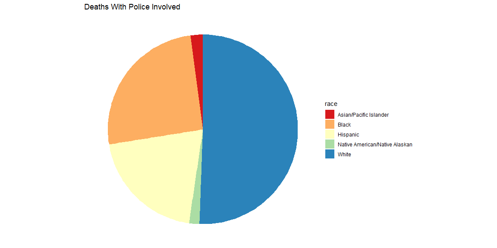
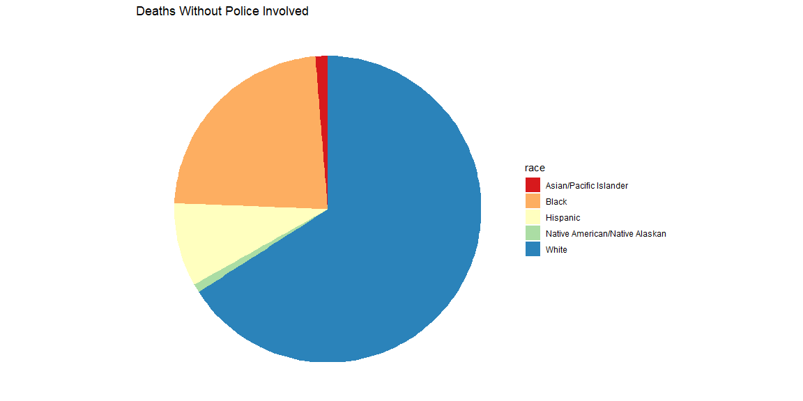

## Background

The world is a dangerous place. In recent years there has been a lot of discussion about gun deaths. Referencing FiveThirtyEight.com's report on [gun deaths in 2016](https://fivethirtyeight.com/features/gun-deaths/), I have created several visualizations to address some questions. I used a clean version of their data posted to their GitHub repo called [full_data.csv](https://github.com/fivethirtyeight/guns-data).

FiveThirtyEight’s visualizations focused on yearly averages. I decided to create visualizations to answer the following questions:
- What is the relationship between intent and time of year? Specifically, is there a relationship between suicides and seasonal depression?
- What is the relationship between death count and race? Specifically, deaths caused by the police? 


## Setup
```r
# This R-chunk imports all the datasets and libraries needed for the project
data <- read.csv('https://raw.githubusercontent.com/fivethirtyeight/guns-data/master/full_data.csv')
```

## Data Wrangling
```r
# This R-Chunk cleans & wrangles the data
yespolice <- data %>%
filter(police == 1)

nopolice <- data %>%
filter(police == 0)
```

## Intent and Time of Year
This chart tries to find a connection between intent and time of year from 2012-2014. I was wondering if suicides might increase during the winter months due to seasonal depression. Or if deaths in general increased or decreased during any time of the year. Looking at the graph I do not see any DISTINCT patterns except that overall deaths are lowest in February each year.


```r
# Plot and Visualize
ggplot(data = data, aes(x=month)) + 
  geom_bar(aes(fill=intent)) + 
  facet_wrap(~year) + 
  theme_dark() + 
  scale_fill_brewer(palette = "OrRd")
```

<!-- -->

## Race and Police Involvment

These charts are grouped by race and show the deaths with and without the police involved. In the first chart we can clearly see that the most commonly killed race shot by police officers is white. 
However, when comparing the proportions of the two charts, I see that the white and Hispanic categories proportionally very different. Police deaths decrease the proportion of white deaths, but increase the proportion of Hispanic deaths by a noticable amount. Examining both charts carefully I see that all race deaths EXCEPT for white are increased when police are involved even if not by much. 

```r
# Plot and Visualize
ggplot(data = yespolice, aes(x="")) + 
  geom_bar(aes(fill = race)) + 
  coord_polar("y", start=0) +
  theme_void() +
  labs(title = "Deaths With Police Involved") +
  scale_fill_brewer(palette = "Spectral")
```

<!-- -->

```r
ggplot(data = nopolice, aes(x="")) + 
  geom_bar(aes(fill = race)) + 
  coord_polar("y", start=0) +
  theme_void() +
  labs(title = "Deaths Without Police Involved") +
  scale_fill_brewer(palette = "Spectral")
```

<!-- -->


